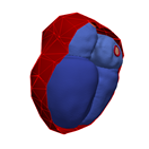
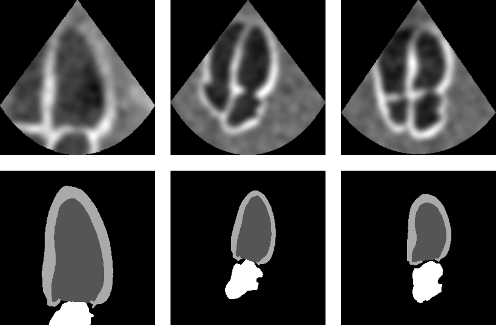

# Pseudo Image Extraction

Extract pseudo images from anatomical models. 

This repository is specifically designed for extracting images from cardiac models as described in 
[Generating Synthetic Labeled Data from Anatomical Models: An Example with Echocardiography Segmentation](https://adgilbert.github.io/data-generation/). It may 
be used as a template for extracting image from other models as well. 

The main script for extracting data is `create_seg_dataset.py`. Options are controlled at several different levels:

1. **General options**: These options include things such as the location of the model files, how many images should be 
extracted, what view (slice) should be extracted, how many images should be extracted, and some additional parameters. 
An overview of these parameters can be seen by running `create_seg_dataset.py -h` or looking at the argument parser 
defined in `export_config.py`.
2. **View-specific options**: These options define the specific model manipulations that are required for a given view. 
They are defined in a series of sub-steps which encompass movement transforms (getting the slice into the right 
orientation and position) and appearance transforms. Specific transforms can be defined for each view for each of these 
sub-steps in the `get_view_specific_params()` function in `export_config.py`.
3. **Dataset-specific options**: There may be cases where several parameters need to be defined for a given dataset. 
For example in the case of apical echocardiography images a dataset specific parameter might be the percentage of images
that are focused on the left ventricle compared to the percentage of images focused on the whole heart. 

## Input

The input is a set of anatomical models. In particular the input for this project was a set of cardiac anatomical 
models. These models will be released pending a publication describing their development and a link to those 
models will be provided here once they are. 

In particular this project also used an augmented set of models (see 
[paper](https://adgilbert.github.io/data-generation/)). A link to the augmented model set will also be provided.

An example model is shown above. 

## Output

The output of this step is a set of:
 1. Pseudo-ultrasound images which contain slices from the model which match slices from real hearts observed in a set
 of real ultrasound images of the given view. An example for apical four chamber images is shown in the image below.
 2. Labels for the pseudo-ultrasound images. These labels mark the relevant regions of the pseudo images and can 
 be used when training a segmentation network. An example is shown below. 
  
  
## Install

Clone this repository and install the necessary requirements `pip install -r requirements.txt`.

